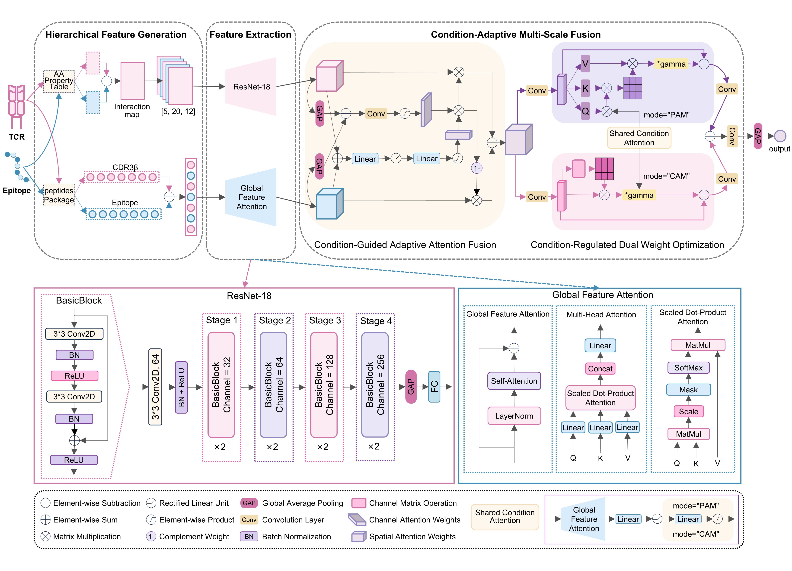

# DAISY

## Introduction
**DAISY** A biologically informed vision-guided framework for interpretable T cell receptor–epitope binding prediction.



## Installation

### 1. Create virtual environment (optional but highly recommended)  
#### Command
```bash
conda create -n DAISY python==3.10.14
conda activate DAISY
```
### 2. Install dependencies
#### Dependencies
- torch==1.12.1
- numpy==1.26.4
- pandas==2.2.2
- scikit-learn==1.5.1
- tqdm==4.66.5
- peptides==0.3.4  

*Note : If you use the GPU, you should install CUDA and cuDNN version compatible with the pytorch version. [Version Searching](https://pytorch.org/)
#### Command
```bash
pip install -r requirements.txt
```
*Note: This will automatically install all the libraries you need to run the code. Make sure your Python environment is activated before running this command.

##  Folder Structure
The following directory structure outlines the organization of the DAISY project, including training data, test sets, model files, and scripts for training and evaluation.

```
DAISY/
  ├─ data/                               # All input data
  │   ├─ tcr_peptide_train.csv           # Training data (peptide, cdr3)
  │   ├─ small_healthy_tcr.csv           # Healthy TCRs (for generating negatives)
  │   └─ test_data/                      # Test sets for different evaluation settings
  │       ├─ Seen-Pair.csv
  │       ├─ Unseen-TCR.csv
  │       ├─ Unseen-Epitope.csv
  │       └─ Unseen-Pair.csv
  │
  ├─ model/
  │   └─ DAISY.pt                        # Trained model checkpoint
  │
  ├─ output/                             # Output predictions
  │  
  ├─ train.py                            # Training script
  ├─ test.py                             # Prediction script
  ├─ tools.py                            # Utility functions (e.g. early stopping)
  ├─ requirements.txt                   # Python dependency list
  └─ README.md                          # Project documentation
```
## Data

### Training Data

The training dataset should be a CSV file containing TCR–peptide pairs with the following columns:

| Column | Description |
|--------|-------------|
| `peptide` | Amino acid sequence of the epitope (string) |
| `cdr3` | CDR3 sequence of the TCR β-chain (string) |

Example (CSV format):

```csv
peptide,cdr3
SIINFEKL,CASSIRSSYEQYF
GILGFVFTL,CASSLGGTDTQYF
```
*Note: Training CSV files should be placed under the specified --input (e.g., ./data/tcr_peptide_train.csv).

In addition, a separate file with healthy individuals' TCRs is needed to generate negative samples.
Example:
```csv
cdr3
CASSLGGTDTQYF
CASSIGSYEQYF
```
*Note: Healthy CSV files should be placed under the specified --healthy_tcr (e.g., ./data/small_healthy_tcr.csv).

### Test Data
Each test file must be a CSV file containing:
| Column  | Description                                      |
|---------|--------------------------------------------------|
| peptide | Epitope sequence (string)                        |
| cdr3    | TCR CDR3 sequence (string)                       |
| label   | Ground truth label: `1` for binding, `0` for non-binding |

Example:
```csv
peptide,cdr3,label
SIINFEKL,CASSIRSSYEQYF,1
GILGFVFTL,CASSLGGTDTQYF,0
```
*Note: Test CSV files should be placed under the specified --input_dir (e.g., ./data/test_data/).

## Model Training

### Command
```bash
python train.py \
  --input ./data/tcr_peptide_train.csv \
  --healty_tcr ./data/small_healthy_tcr.csv \
  --model_dir ./model/DAISY.pt \
  --batch_size 256 \
  --lr 1e-3 \
  --max_epoch 500 \
  --seed 123
```
- `--input`: path to the input training data (CSV file). Required columns: `peptide`, `cdr3`.
- `--healty_tcr`: path to healthy individuals' TCR sequences (CSV file). 
Required column: `cdr3`.
- `--model_dir`: directory to save the trained model checkpoint (e.g., `DAISY.pt`).
- `--batch_size`: mini-batch size for training. Default: `256`.
- `--lr`: initial learning rate for model optimization. Default: `1e-3`.
- `--max_epoch`: maximum number of training epochs. Default: `500`.
- `--seed`: random seed for reproducibility. Setting a seed ensures consistent results across runs.


## Model Prediction

### Command
```bash
python test.py \
  --input_dir ./data/test_data/ \
  --tcr_peptide_model ./model/DAISY.pt \
  --batch_size 64 \
  --output_dir ./output/
```
- `--input_dir`: directory containing one or more input test CSV files. Each file must include the columns: `peptide`, `cdr3`, and `label`.
- `--tcr_peptide_model`: path to the trained TCR–peptide binding prediction model (`*.pt` file).
- `--batch_size`: mini-batch size for prediction. Default: `64`.
- `--output_dir`: directory to save the prediction results.


